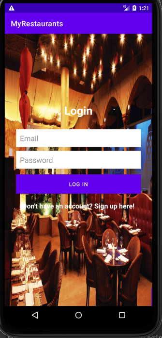
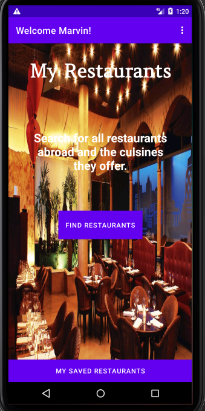
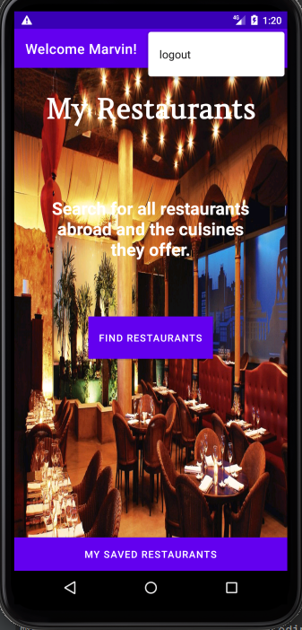
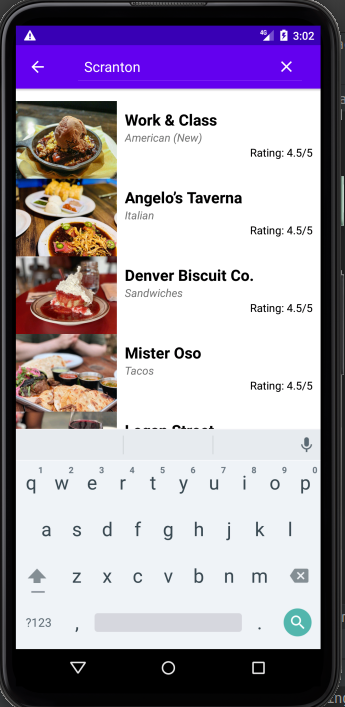
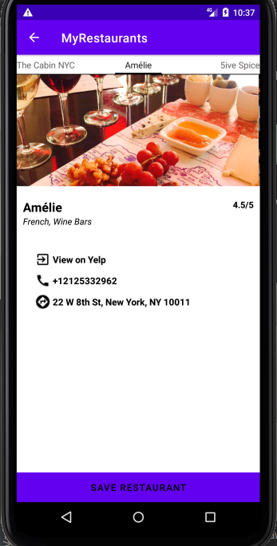
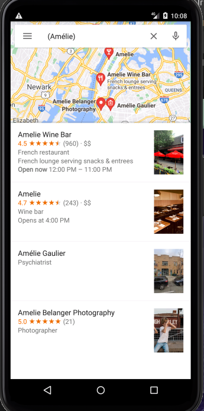

# MY RESTAURANTS
#### This is an app that allows the user to search for restaurants abroad and also displays the best cuisines offered.

## Demo









## Setup/Installation Requirements
* Fork/Clone the repository
```
   $ git clone https://github.com/andreassenmarvin/My-Restaurants.git
```
* Open your project on Android Studio.
* Run the project.

## Known Bugs
No known bugs
## Technologies Used
* Java
* Android
## Support and contact details
Incase of any contributions,query or issues,you can reach me through the email below:
machariamarvin625@gmail.com
### License
This project is licensed under the [MIT LICENSE](https://github.com/andreassenmarvin/My-Restaurants/blob/master/LICENSE) 
